<div align="center">
  
</div>

<br />

## Item 2: Identity Kernel
```yaml
System: Parth Lawand
Role: Backend Engineer | Systems Thinker
Architecture_Bias: [ "Event-Driven", "Fault-Tolerant", "Distributed" ]
Primary_Runtime: Java (Spring Boot)
Secondary_Runtime: Python
Latency_Sensitivity: HIGH
Scale_Awareness: ENABLED
```

<br />

## Item 3: Live Systems (Active Microservices)

<table>
  <tr>
    <td width="60%">
      <h3>Distributed Event-Driven Workflow Orchestrator</h3>
      <p>A scalable orchestration engine managing complex asynchronous workflows.</p>
      <code>Kafka</code> <code>Spring Boot</code> <code>DLQ</code> <code>Retries</code>
    </td>
    <td width="40%" align="right">
      
      <br />
      <strong>Throughput:</strong> 5k EPS <br />
      <strong>Uptime:</strong> 99.9%
    </td>
  </tr>
  <tr>
    <td>
      <h3>Secure Employee Management System</h3>
      <p>Role-based access control system with audit logging and high security.</p>
      <code>Spring Security</code> <code>JWT</code> <code>MySQL</code> <code>Docker</code>
    </td>
    <td align="right">
      
       <br />
      <strong>Security:</strong> AES-256 <br />
      <strong>Audit:</strong> Enabled
    </td>
  </tr>
  <tr>
    <td>
      <h3>Terms & Conditions Summariser</h3>
      <p>NLP pipeline to extract key liabilities from legal documents.</p>
      <code>Python</code> <code>Transformers</code> <code>NLP</code> <code>REST</code>
    </td>
    <td align="right">
      
       <br />
      <strong>Recall:</strong> 94% <br />
      <strong>Latency:</strong> 200ms
    </td>
  </tr>
</table>

<br />

## Item 4: Verified Logs (Immutable Ledger)

```log
[2024-01-15T10:00:00Z] [INFO]  SCHOLAR_AWARD: Reliance Foundation Undergraduate Scholar (Top 5%)
[2023-11-20T14:30:00Z] [INFO]  CERTIFIED: Oracle Certified Java SE 17 Developer
[2023-09-05T09:15:00Z] [INFO]  CERTIFIED: OCI Generative AI Professional
[2023-06-10T16:45:00Z] [INFO]  SYSTEM_UPGRADE: Advanced Distributed Systems Architecture
```

<br />

## Item 5: Skill Dependency Graph

<div align="center">
  
</div>

<br />

## Item 6: Signal Strength (Community & Leadership)

| Scope | Impact Radius | Signal Type |
| :--- | :--- | :--- |
| **Mentorship** | Global | `1:1 Guidance` `Code Reviews` |
| **Workshops** | University | `Tech Talks` `Hands-on Labs` |
| **Teams** | 5+ Engineers | `Tech Lead` `Architecture Design` |

<br />

## Item 7: Global Interface (Endpoints)

<div align="center">

| Protocol | Endpoint | Status |
| :--- | :--- | :--- |
| **HTTP/GET** | [`/github/parthlawand`](https://github.com/parthlawand) | 200 OK |
| **HTTP/POST** | [`/linkedin/in/parthlawand`](https://linkedin.com/in/parthlawand) | 201 CREATED |
| **SMTP** | [`mailto:contact@parthlawand.dev`](mailto:contact@parthlawand.dev) | CONNECTED |

</div>

<br />

<div align="center">
  <code>Localization Support: [ "EN-US", "HI-IN", "MR-IN", "DE-DE" ]</code>
</div>
