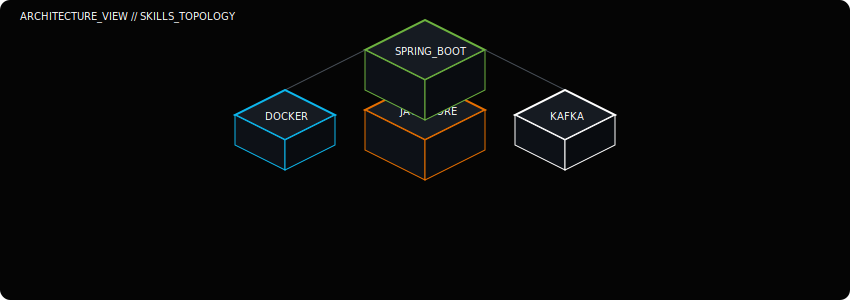

<div align="center">
  
</div>

<br />

### `SYSTEM_KERNEL` // IDENTITY_RESPONSE

```json
{
  "ENTITY": "Parth Lawand",
  "CLASS": "L5_Systems_Architect",
  "RUNTIME_ENVIRONMENT": {
    "PRIMARY": "Java (Spring Boot)",
    "SECONDARY": "Python",
    "INFRASTRUCTURE": ["AWS", "Docker", "Kubernetes"]
  },
  "CORE_DIRECTIVES": [
    "Design Fault-Tolerant Systems",
    "Optimize for High Throughput",
    "Automate Everything"
  ],
  "STATUS": "READY_FOR_DEPLOYMENT"
}
```

<br />

### `KUBERNETES_CLUSTER` // LIVE_DEPLOYMENTS

<pre>
USER@PARTH-LAWAND:~# kubectl get pods -o wide --namespace=production
NAME                                    READY   STATUS    RESTARTS   AGE    IP              NODE
<a href="#">workflow-orchestrator-7d9f8c</a>        1/1     Running   0          42d    10.0.1.5        worker-scaling-nodegroup
<a href="#">secure-employee-mgmt-5f4b3a</a>         1/1     Running   0          18d    10.0.1.12       worker-security-nodegroup
<a href="#">terms-summariser-nlp-9a2b1f</a>         1/1     Running   2          6h     10.0.2.8        worker-gpu-nodegroup
<a href="#">legacy-monolith-importer</a>            0/1     Completed 0          2y     10.0.3.2        worker-archived
</pre>

<br />

### `SYSTEM_LOAD` // PERFORMANCE_METRICS

<div align="center">
  
</div>

<br />

### `INFRASTRUCTURE_VIEW` // SKILL_TOPOLOGY

<div align="center">
  
</div>

<br />

### `AUDIT_LOGS` // CERTIFIED_EVENTS

> **[INFO]** `Reliance Foundation Undergraduate Scholar` verified at hash `0x5A1...`  
> **[INFO]** `Oracle Certified Java SE 17 Developer` verified at hash `0xB32...`  
> **[INFO]** `OCI Generative AI Professional` verified at hash `0xC99...`  

<br />

### `UPLINK_TERMINAL` // TRANSMISSION

<div align="center">

| CHANNEL | PROTOCOL | STATUS | ACTION |
| :--- | :--- | :--- | :--- |
| **GITHUB** | `HTTPS` |  | [`Global_Pull`](https://github.com/parthlawand) |
| **LINKEDIN** | `WSS` |  | [`Handshake_Init`](https://linkedin.com/in/parthlawand) |
| **EMAIL** | `SMTP` |  | [`Send_Packet`](mailto:contact@parthlawand.dev) |

</div>

<br />

<div align="center">
  <code>// END_OF_TRANSMISSION</code>
</div>
